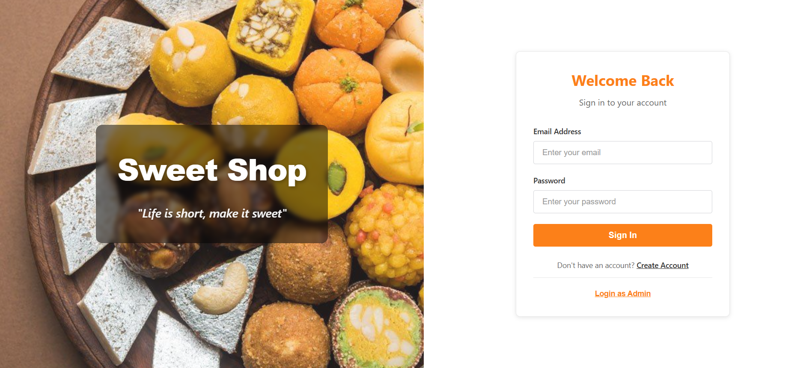
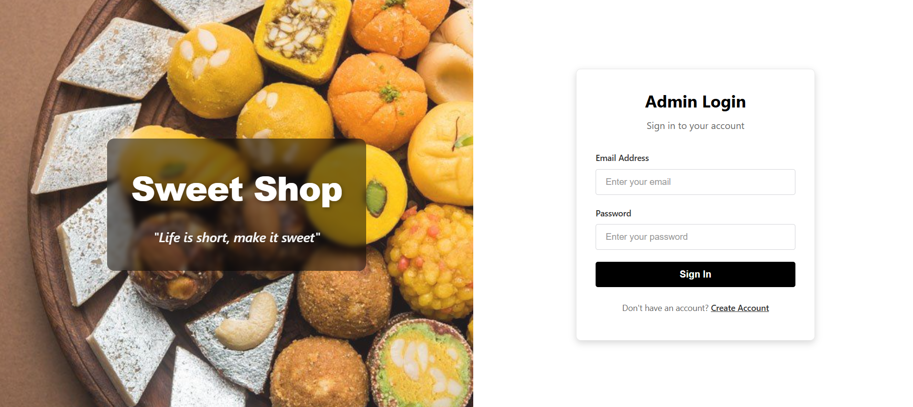

# Sweet Shop Management System

A full-stack web application for managing a sweet shop inventory. Users can browse sweets, make purchases, and admins can manage the inventory.

**Live Application:** [https://sweetshop-management.netlify.app/](https://sweetshop-management.netlify.app/)

**GitHub Repository:** [https://github.com/Sarat20/sweet-shop-management](https://github.com/Sarat20/sweet-shop-management)

## Project Overview

This application provides a complete solution for sweet shop management with two user roles:

- **Regular Users:** Browse sweets, search by name/category/price, and purchase items
- **Admin Users:** Manage inventory by adding, updating, and deleting sweets

### Features

- User registration and authentication
- Admin login with separate interface
- Browse and search sweets
- Filter by category and price range
- Purchase sweets (reduces stock quantity)
- Admin dashboard for inventory management
- Add, update, and delete sweets (admin only)
- Responsive design

## Technology Stack

### Backend
- Node.js
- Express.js
- MongoDB with Mongoose
- JWT authentication
- bcryptjs for password hashing

### Frontend
- React
- React Router DOM
- Axios for API calls
- Vite for build tooling

### Testing
- Jest (Backend)
- Vitest (Frontend)
- React Testing Library

## Prerequisites

Before running this project, ensure you have:

- Node.js (version 20.19+ or 22.12+)
- MongoDB Atlas account (free tier available)
- Git

## Setup Instructions

### Backend Setup

1. Navigate to the backend directory:
```bash
cd backend
```

2. Install dependencies:
```bash
npm install
```

3. Create a `.env` file in the backend directory with the following variables:
```
MONGO_URI=your_mongodb_connection_string
JWT_SECRET=your_secret_key
PORT=5000
```

4. Create admin user:
```bash
npm run create-admin
```

This creates an admin user with:
- Email: `admin@sweetshop.com`
- Password: `admin123`

5. Start the backend server:
```bash
npm run dev
```

The server runs on `http://localhost:5000`

### Frontend Setup

1. Navigate to the frontend directory:
```bash
cd frontend
```

2. Install dependencies:
```bash
npm install
```

3. Start the development server:
```bash
npm run dev
```

The application opens at `http://localhost:5173`

## Running the Application

1. Start the backend server first:
   - Open terminal in `backend` folder
   - Run `npm run dev`
   - Wait for "Server running on port 5000" and "MongoDB connected"

2. Start the frontend server:
   - Open a new terminal in `frontend` folder
   - Run `npm run dev`
   - The app opens in your browser

3. Access the application:
   - Regular user: Register a new account or use existing credentials
   - Admin: Click "Login as Admin" and use `admin@sweetshop.com` / `admin123`

## Project Structure

```
sweet-shop-management/
├── backend/
│   ├── src/
│   │   ├── config/        # Database configuration
│   │   ├── middleware/    # Authentication middleware
│   │   ├── models/        # MongoDB models
│   │   ├── routes/        # API routes
│   │   ├── tests/         # Backend tests
│   │   └── server.js      # Server entry point
│   ├── scripts/           # Utility scripts
│   └── package.json
├── frontend/
│   ├── src/
│   │   ├── api/           # API client
│   │   ├── components/    # React components
│   │   ├── pages/         # Page components
│   │   ├── test/          # Frontend tests
│   │   └── utils/         # Utility functions
│   └── package.json
└── README.md
```

## API Endpoints

### Authentication
- `POST /api/auth/register` - Register new user
- `POST /api/auth/login` - User login

### Sweets (Protected)
- `GET /api/sweets` - Get all sweets
- `GET /api/sweets/search` - Search sweets
- `POST /api/sweets` - Add new sweet (Admin only)
- `PUT /api/sweets/:id` - Update sweet (Admin only)
- `DELETE /api/sweets/:id` - Delete sweet (Admin only)
- `POST /api/sweets/:id/purchase` - Purchase sweet
- `POST /api/sweets/:id/restock` - Restock sweet (Admin only)

## Screenshots

### Setup

**1. Starting Backend Server**
Backend server running on port 5000 with MongoDB connection established.


**2. Starting Frontend Server**
Frontend development server running on localhost:5173.


### Authentication

**3. Home Dashboard**
Regular user login form with email and password fields.


Separate admin login interface with black and white theme.


**4. User Registration**
User registration form with name, email, and password fields.


**5. User Login Credentials**
User successfully logged in and redirected to dashboard.


### User Interface

**6. User Dashboard**
Regular user view showing sweets with search and filter options. Users can view sweet details and purchase items.


### Admin Interface


**7. Admin Login Credentials**
Admin login form with credentials filled in.


**8. Admin Dashboard**
Admin view with full inventory management. Admins can add, update, delete sweets and manage stock.


**9. Adding New Sweet**
Form for admins to add new sweet items with fields for name, category, price, and quantity.


**10. User Dashboard Updated**
User dashboard showing updated stock after purchase.


**11. Admin Dashboard Updated**
Admin dashboard showing updated sweet information after editing.


**12. Updating Stock**
Admin updating the stock quantity of an existing sweet.


**13. Admin Dashboard Stock Update**
Admin dashboard reflecting stock changes after updates.


**14. Admin Logout**
Admin logout interface showing logout confirmation.


### User Interface Updated

**15. Search and Filter**
Search and filter functionality allowing users to find sweets by name, category, and price range.


**16. Newly Added Sweet**
Newly added sweet appears in the dashboard with all details.


**17. Purchase Sweet**
User purchasing a sweet. Stock quantity decreases after purchase.


## Testing

### Backend Tests
Run backend tests:
```bash
cd backend
npm test
```

Test coverage: 95.34%

### Frontend Tests
Run frontend tests:
```bash
cd frontend
npm test
```

Total tests: 31 (25 backend + 6 frontend)

See [TEST_REPORT.md](./TEST_REPORT.md) for detailed test results.

## Deployment

### Backend (Render.com)
- Deployed at: `https://sweet-shop-management-mavp.onrender.com`
- Environment variables configured in Render dashboard
- MongoDB Atlas IP whitelist configured

### Frontend (Netlify)
- Deployed at: [https://sweetshop-management.netlify.app/](https://sweetshop-management.netlify.app/)
- Automatic deployment from GitHub
- SPA routing configured with `_redirects` file

## My AI Usage

I used ChatGPT to assist with this project in the following ways:

### Code Generation
- Generated initial boilerplate code for API routes 
- Created test cases for few backend and frontend part
- Helped with error handling 

### Problem Solving
- handled bussiness logicc as per the requirement of the assignment
- Debugged authentication issues and CORS configuration
- Fixed routing problems in React Router
- Resolved deployment issues on Render and Netlify

### Code Review
- Reviewed code structure and suggested improvements
- Identified and fixed security issues

### Documentation
- Assisted in writing clear setup instructions
- Helped structure the README file
- Generated API endpoint documentation

### Learning and Guidance
- Explained concepts like JWT authentication, CORS, and SPA routing
- Provided best practices for React and Node.js development
- Guided through deployment processes


